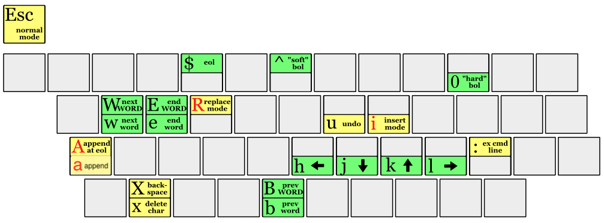

# swfc

# linux commands

## basic

| command | description |
|:---:|---|
| ls | list directory contents
| df | disk free, disk 사용량을 출력. -h: human, 사람이 알아보기 쉽게
| man | manual, online reference manual. 명령어들에 대한 정보를 확인할 수 있다.
| which | which command, command의 위치
| type | type of command, command의 type. external: location info.
| pwd | print working directory, 현재 working deirectory를 알려줌.
| cd | change directory, working directory를 변경. / : root dir, ~ : home dir
| mkdir | make directory, directory를 만듦
| rmdir | remove directory, directory를 지움
| file | file type, file type 확인
| touch | touch file, file의 timestamps, atime과 mtime update. file이 없으면 생성
| echo | echo text, text를 출력
| cp | copy
| mv | move, file의 위치를 옮기거나 이름 변경
| rm | remove, 없애기. file과 directory
| ln | link, file, directory를 다른 이름으로 연결
| cat | concatenate, file의 내용을 stdout에 붙여줌. 내용을 출력하여 확인
| more | more print, file의 내용을 화면 단위로 출력
| less | less print, file의 내용을 화면 단위로 출력. more 기능의 확장.
| head | head of file, file의 앞 부분(10 줄)만 출력
| tail | tail of file, file의 끝 부분(10 줄)만 출력
| umask | user file-creation mask
| chmod | change file mode, file mode, 접근 권한을 수정
| chown | change owner, file의 소유자를 수정
| chgrp | change group, file의 소유 group을 수정
| umask | user file creation mask, file 생성시 접근 권한에 대한 mask를 확인/설정
| grep | global regular expression print, RegEx(정규 표현식) pattern 찾기

## indispensable commands

| command | description |
|:---:|---|
| su | substitute user, user를 바꿈. user가 명기되지 않을 경우 root (super user)
| sudo | substitute user do, 다른 user(-u user) or root 권한으로 실행.
| id | ID of user, user ID를 출력
| useradd | user add, user와 같은 이름의 primary group 생성. 같은 이름의 group이 있을 경우 -g option 사용.
| passwd | password, pw 설정
| usermod | user modfy, user 설정 변경
| userdel | user delete, user와 같은 이름의 group 삭제. group에 다른 user가 있을 경우 group은 지워지지 않는다.
| groupadd | group add, group 생성
| groupmod | group modify, group 이름이나 id 변경
| gpasswd | group password, group pw 설정 및 user 추가
| groupdel | group delete, group 제거
| ps | process snapshot, process info를 확인. -ef option: `e`ntire process `f`ull-format display
| tar | tape archive, 하나로 묶어주거나 풀때 사용
| date | date print, date와 time을 출력
| find | find file, file search
| sort | sort, line 단위의 정렬
| tee | T(tee) pipe fitting (T plumbing device), stdin을 stdout & file로 전달
| uniq | unique, line 단위로 unique하게, 즉, 중복되는 line은 하나만 남긴다.
| tr | translate, 입력된 문자열을 변화시켜 출력
| wc | word count, option에 따라 line, word, byte count
| cut | cut line, 행에서 선택된 부분을 출력. -d : delimiter(구분자)를 기준으로 구분(cut)구분.
| mount | mount filesystem, portable storage device를 file tree에 mount
| umount | un-mount filesystem, mounted storage device를 해제
| mkfs | make filesystem, 특정 filesystem으로 format
| dd | copy and convert, cc가 c compile에서 먼저 사용되어서 dd라고 부름. file을 format에 맞추어 변경하여 copy
| set | set option, set or unset shell option. -\<option>: set option, +\<option>: unset option
| sed | stream editor
| awk | AWK interpreter
| read | read a single line from  stdin. -t : timeout option, TIMEOUT 변수 값 (sec), 0일 경우 무한.

## man command

    man [section] <command>

| section # | description
|:---:|---|
| 1 |   Executable programs or shell commands
| 2 |   System calls (functions provided by the kernel)
| 3 |   Library calls (functions within program libraries)
| 4 |   Special files (usually found in /dev)
| 5 |   File formats and conventions eg /etc/passwd
| 6 |   Games
| 7 |   Miscellaneous (including macro packages and conventions), e.g. man(7), groff(7)
| 8 |   System administration commands (usually only for root)
| 9 |   Kernel routines [Non standard]

---

## Normal mode

### basic editing

[ 출처: <https://sites.google.com/site/duovpage/spargalka-po-vim/uroki-vim-v-kartinkah>](<https://sites.google.com/site/duovpage/spargalka-po-vim/uroki-vim-v-kartinkah>)

| keys | description
|:---:|---|
| h, j, k, l | cursor keys
| $, 0, ^ | End, Start, First char of Line
| w, e, b | 단어 단위의 이동. 구두점들도 하나의 단어로 취급
| W, E, B | 단위 단위의 이동. 공백을 기준으로 단어 구분
| i | insert mode, cursor 위치에서 insert mode start
| I | insert mode, cursor 행의 맨 처음부터 insert mode start
| a | append mode, cursor 다음 위치에서 insert mode start
| A | append mode, cursor가 있는 line 마지막 부터 insert mode start
| r | replace character. cursor 위치의 문자를 수정
| R | replace mode.
| u | undo.
| ctrl + r | redo
| esc | escape to normal mode, normal mode로 전환
| : | command mode
